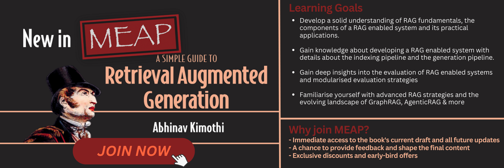

# A Simple Guide to Retrieval Augmented Generation
 This repository is the source code for examples and illustrations discussed in the book - [A Simple Guide to Retrieval Augmented Generation](https://mng.bz/8wdg) published by [Manning Publications](https://www.manning.com/?utm_source=kimothi&utm_medium=affiliate&utm_campaign=affiliate&a_aid=kimothi)

<a href="https://mng.bz/8wdg" target="_blank">
    
</a>

 Retrieval Augmented Generation, or RAG, stands as a pivotal technique shaping the landscape of the applied generative AI. A novel concept introduced by Lewis et al in their seminal paper Retrieval-Augmented Generation for Knowledge-Intensive NLP Tasks (https://arxiv.org/abs/2005.11401), RAG has swiftly emerged as a cornerstone, enhancing reliability and trustworthiness in the outputs from Large Language Models (LLMs)

About the book
---
This book is a foundational guide designed particularly for beginners looking for an easy, yet comprehensive introduction to Retrieval Augmented Generation. This book does not go deep into the technical nitty-gritties of RAG rather provides an overview. Data Scientists, Data Engineers, ML Engineers, Software Developers, Technology Leaders, Students and Academicians interested in generative AI powered application development will find this book valuable. Upon completing this book, you can expect to:

- Develop a solid understanding of RAG fundamentals, the components of a RAG enabled system and its practical applications.

- Know what a non-parametric knowledge base for RAG means and how is it created.

- Gain knowledge about developing a RAG enabled system with details about the indexing pipeline and the generation pipeline.
- Gain deep insights into the evaluation of RAG enabled systems and modularised evaluation strategies

- Familiarize yourself with advanced RAG strategies and the evolving landscape

- Acquire knowledge of available tools, technologies and frameworks for building and deploying production grade RAG systems

- Get an understanding of the current limitations of RAG and an exposure to popular emerging techniques for further exploration

__Note: This book is still in development and is scheduled to be completed in the next few months__

Link to the [official source code repository](https://github.com/abhinav-kimothi/A-Simple-Introduction-to-RAG)

Link to [join the MEAP at manning.com](https://mng.bz/8wdg)

To download a copy of this repository, click on the [Download ZIP](https://github.com/abhinav-kimothi/A-Simple-Introduction-to-RAG/archive/refs/heads/main.zip) button or execute the following command in your terminal:

```
git clone https://github.com/abhinav-kimothi/A-Simple-Introduction-to-RAG.git
```


Table of Contents
---

The first three chapters of the book have been released as a part of the Manning Early Access Program. You can [join the MEAP here](https://mng.bz/8wdg)

- Chapter 1 - Large Language Models and the Need for Retrieval Augmented Generation [First draft Released]

- Chapter 2 - RAG-enabled systems and their design [First draft Released]

- Chapter 3 - Indexing Pipeline : Creating a knowledge base for RAG based applications [First draft Released] [Notebook](./Chapters/Chapter-03/indexing_pipeline.ipynb)

- Chapter 4 - Generation Pipeline: Real time interaction for contextual responses [Notebook](./Chapters/Chapter-04/generation_pipeline.ipynb)

- Chapter 5 - RAG Evaluation : Checking accuracy, relevance and faithfulness [Notebook](./Chapters/Chapter-05/rag_evaluations.ipynb)

- Chapter 6 - Evolving RAGOps Stack : Technologies that make RAG possible

- Chapter 7 - Progression of RAG systems : Naive to Advanced to Modular

- Chapter 8 - Nuances : Comparison with fine-tuning, multimodal and agentic RAG

- Chapter 9 - Cutting Edge : Best practices and further exploration

Why join MEAP?
---
By joining the Manning Early Access Program, you'll get:
- Immediate access to the book's current draft and all future updates
- A chance to provide feedback and shape the final content
- Exclusive discounts and early-bird offers

Code
---
Code Snippets are organised in the Chapters Directory by [Chapters](./Chapters)


- Chapter 1 - Does not have any code

- Chapter 2 - Does not have any code

- [Chapter 3 - This notebook](./Chapters/Chapter-03/indexing_pipeline.ipynb) outlines the indexing pipeline. 

    A knowledge base is created for the 2023 Cricket World Cup based on the Wikipedia Article on the topic. We use __AsyncHtmlLoader__ and __Html2TextTransformer__ to load the article, chunk the text using __RecursiveCharacterTextSplitter__, use __text-embedding-3-large__ from OpenAI to convert chunks into vectors and use __FAISS__ as the vector index to store the embeddings.

- [Chapter 4 - This notebook](./Chapters/Chapter-04/indexing_pipeline.ipynb) outlines the generation pipeline. 

    We use the knowledge base created in Chapter 03 on the wikipedia article on 2023 Cricket World Cup. We load the __FAISS__ index and use the __similarity search__ function to retrieve chunks. We then Augment the user query with the retrieved chunk and use __GPT 4o__ model from OpenAI to generate the response.

    This notebook also includes functions that can be used to generate answers for different queries that a user may want to ask.

    Additionally, this chapter contains [another notebook](./Chapters/Chapter-04/xtra_tfidf_bm25_retriever.ipynb) that shows the usage of TF-IDF and BM25 as retriever algorithms.

- [Chapter 5 - This notebook](./Chapters/Chapter-05/rag_evaluations.ipynb) evaluates the RAG pipeline created in chapters 3 and 4 using the __RAGAS__ framework.

    Additionally, this chapter includes a [notebook](./Chapters/Chapter-05/xtra_benchmarking.ipynb) that uses LangChain Benchmarks to benchmark our RAG pipeline on LangChain QnA docs.


__Note: This is a WIP repository and subsequent chapters will be released on an ongoing basis__

Setup
---

Clone this repository to your local machine:

```
git clone https://github.com/abhinav-kimothi/A-Simple-Introduction-to-RAG.git
```

Navigate to the cloned repository:

    
    cd A-Simple-Introduction-to-RAG

It's recommended to use a virtual environment to avoid conflicts with other projects or system-wide Python packages.

Run the following command to create a virtual environment named myenv (you can name it anything you like):

```
python3 -m venv .myenv
```
Activate the Virtual Environment:           

- On Windows, activate the virtual environment by running:

```
    .myenv\Scripts\activate.bat
```

- On macOS and Linux, activate it with:

```
    source venv/bin/activate
```

Install the package requirements from the requirements.txt by executing the following pip installation command:


```
pip install -r requirements.txt
```

_recommended_: Store your API keys in a .env file:
```
OPENAI_API_KEY=<YOUR API KEY>
LANGCHAIN_API_KEY=<YOUR API KEY>

### You can also look at the .\example_dot_env file in this repo for the structure. Remeber to rename to .env
```

The notebooks in this repository need __python version > 3.11.1__

Feedback & Contribution
---
I'd love to hear what you think about the code here and the book in general. I appreciate and welcome all feedback. You can either post your thoughts, questions, critiques and ideas in the [Discussion forum of this repo](https://github.com/abhinav-kimothi/A-Simple-Introduction-to-RAG/discussions) or if you've purchased the [MEAP](https://mng.bz/8wdg) (https://mng.bz/8wdg) you can also provide your feedback on the [livebook on manning.com](https://livebook.manning.com/book/a-simple-guide-to-retrieval-augmented-generation). 

If you notice any errors or issues with the code, please raise an [issue here in the repo](https://github.com/abhinav-kimothi/A-Simple-Introduction-to-RAG/issues)

About me
---
Hi! I'm Abhinav! I am an entrepreneur and Vice President of Artificial Intelligence at Yarnit. I have spent over 15 years consulting and leadership roles in data science, machine learning and AI. My current focus is in the applied Generative AI domain focussing on solving enterprise needs through contextual intelligence. I'm passionate about AI advancements constantly exploring emerging technologies to push the boundaries and create positive impacts in the world. Let’s build the future, together!

#### If you'd like to chat, I'd be very happy to connect

[](https://github.com/abhinav-kimothi)
[](https://www.linkedin.com/comm/mynetwork/discovery-see-all?usecase=PEOPLE_FOLLOWS&followMember=abhinav-kimothi)
[](https://medium.com/@abhinavkimothi)
[](https://www.instagram.com/akaiworks/)
[](mailto:abhinav.kimothi.ds@gmail.com)
[](https://twitter.com/abhinav_kimothi)
[](https://linktr.ee/abhinavkimothi)
[](https://abhinavkimothi.gumroad.com/)


[If you haven't already, please subscribe to the MEAP of A Simple Guide to Retrieval Augmented Generation here](https://mng.bz/8wdg)

<a href="https://mng.bz/8wdg" target="_blank">
    
</a>

---


